# Sistema Ecommerc Pós Fiap

Neste desafio, busquei desenvolver um sistema de ecommerce que permita aos usuários realizarem as
seguintes operações:
1. Login e Registro de Usuário;
2. Autenticação usando Spring Security;
3. Gestão de Itens;
4. Carrinho de Compras;
 
## Ferreamentas 

1. Framework Spring Boot 3.0.8,
2. Java 17,
3. Maven para gerenciamento das dependências,
4. Hibernate JPA,
5. Lombok para produtividade,
6. Swagger para documentação e testes,
7. Spring Security com JWT,
8. Arquitetura de microsserviços,
9. Apis Rest,
10. Banco de dados Postgres,
11. Docker para conteiner e
12. Junit para testes.

## Arquitetura 
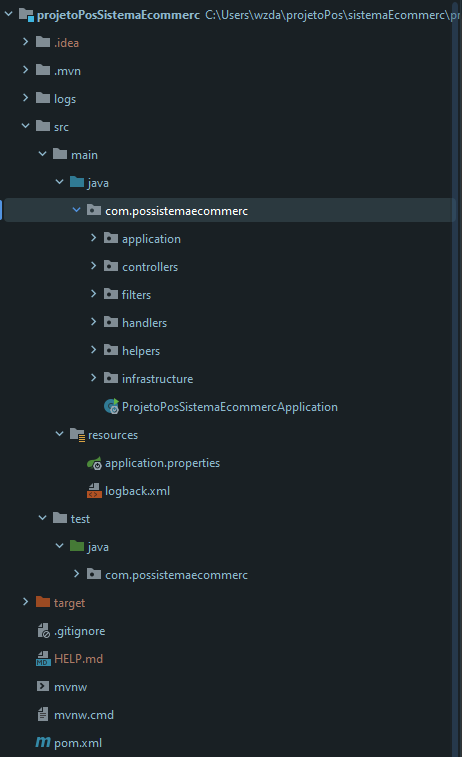

## Bibliotecas utilizadas

* PostGres
* JPA
* Lombok
* Swagger
* JWT
* JavaFalker para testar integração
* Gerando log  

## Application Properties

Porta
  - server.port = 8081

PostgreSQL
  - spring.datasource.url=jdbc:postgresql://localhost:5432/xxxx
  - spring.datasource.username=xxxx
  - spring.datasource.password=xxxx

jpa
  - spring.jpa.database-plataform=org.hibernate.dialect.PostgreSQLDialect
  - spring.jpa.hibernate.ddl-auto=update
  - spring.jpa.properties.hibernate.show_sql=true
  - spring.jpa.properties.hibernate.format_sql=true

Logs
- logging.config=classpath:logback.xml

## EndPoint's
- /api/produtos 
- /api/categorias
- /api/usuarios/autenticar 
- /api/usuarios/criar-conta 
- /api/usuarios/recuperar-senha
- /api/usuarios/atualizar-dados

## Swagger e endPoints
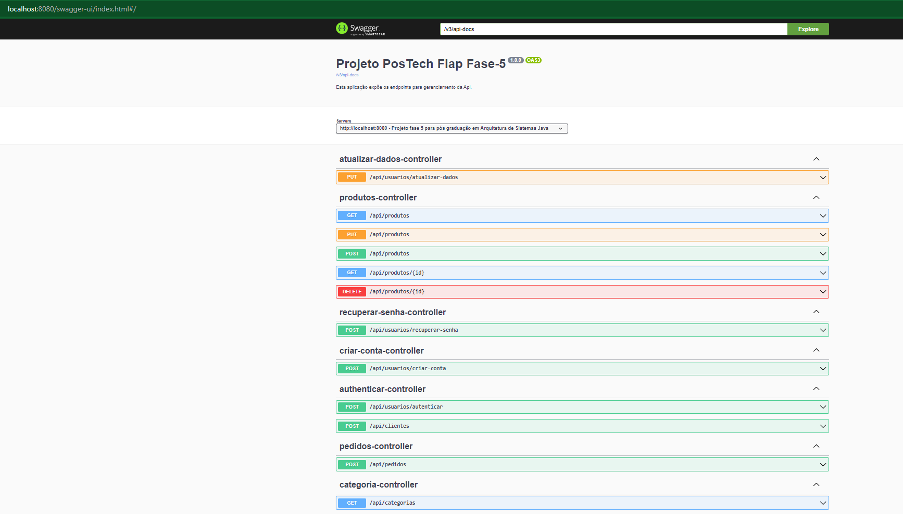

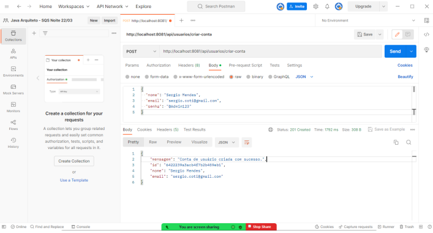 

## Teste JWT
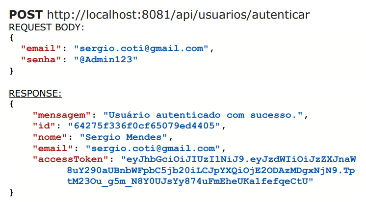 

## Autenticidade JWT
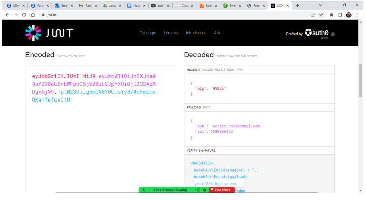

## EndPoint Post
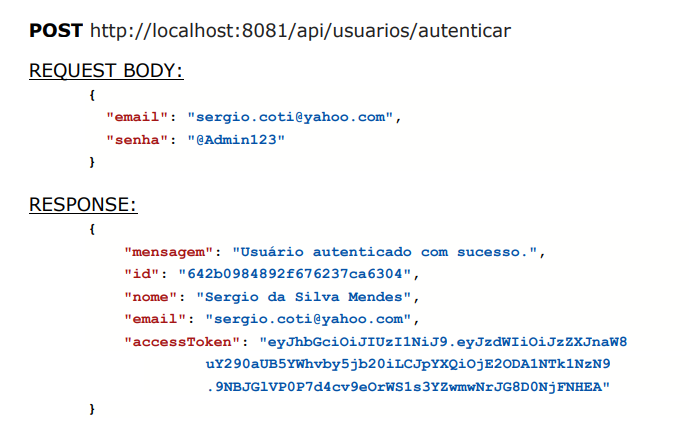

## EndPoint Delete
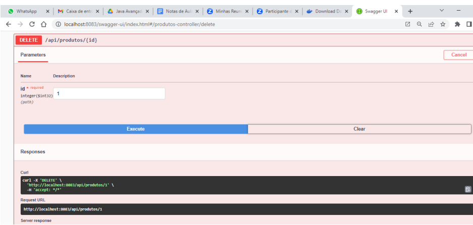

## Categoria
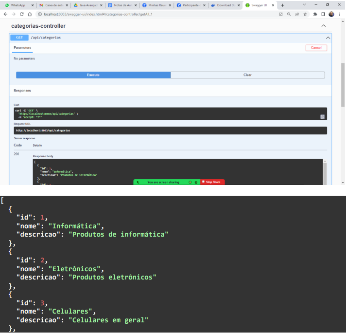

## Produto
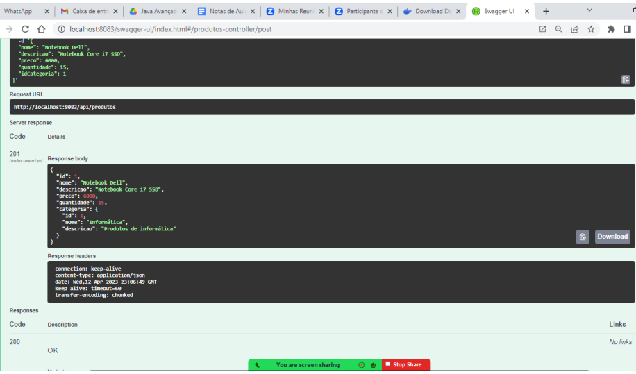

## Banco Categoria
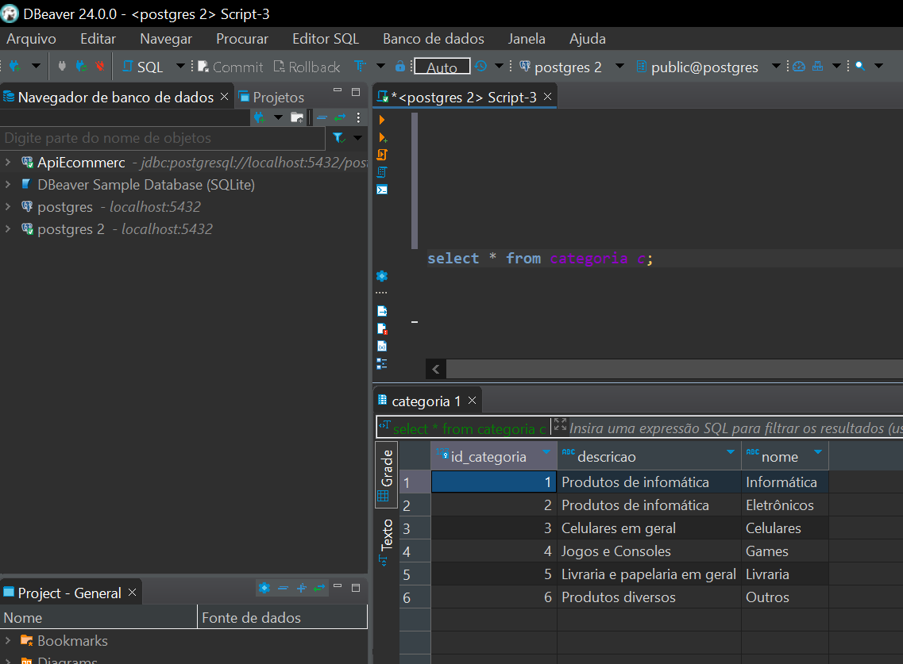

## Banco Produto
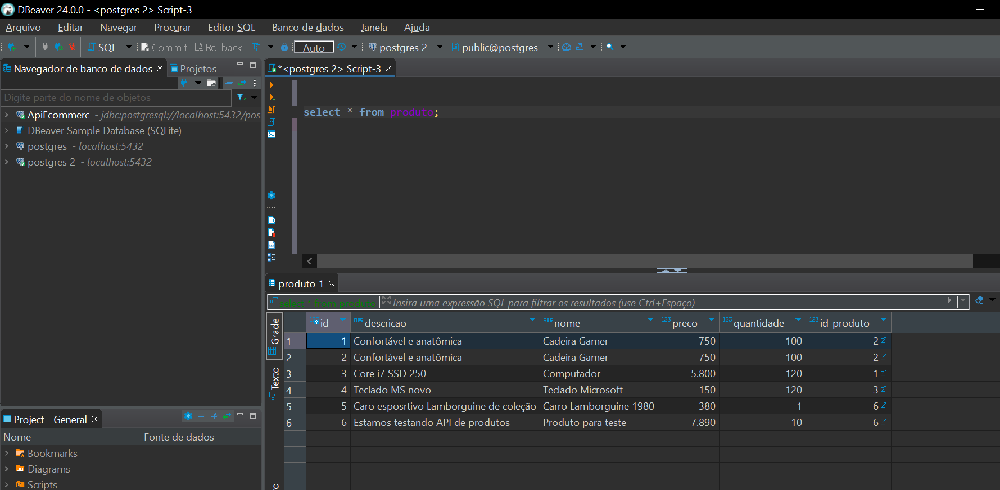

## Banco Usuário
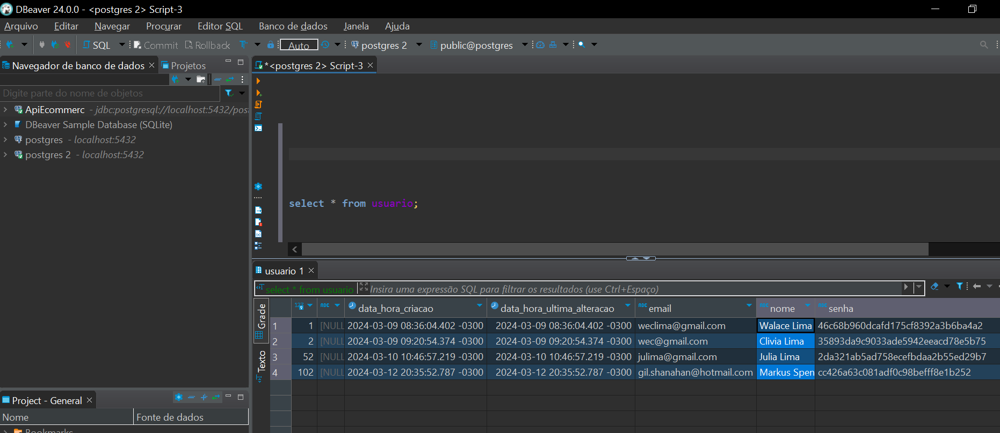 

## Docker
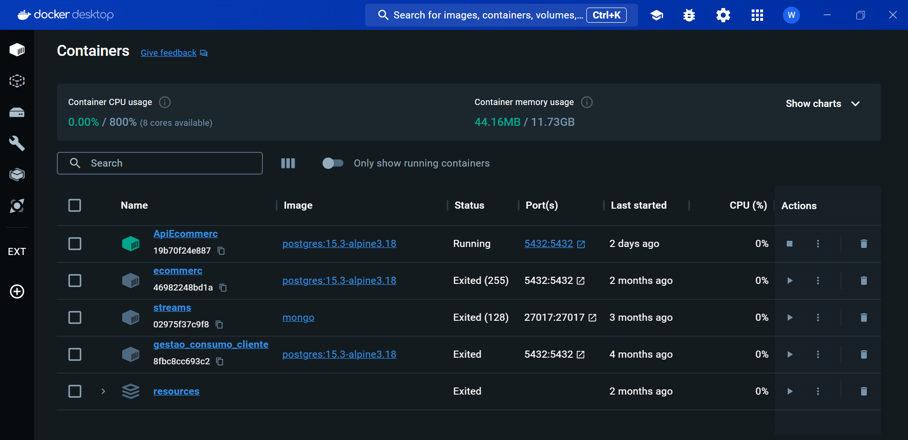 

## Payload Pedido
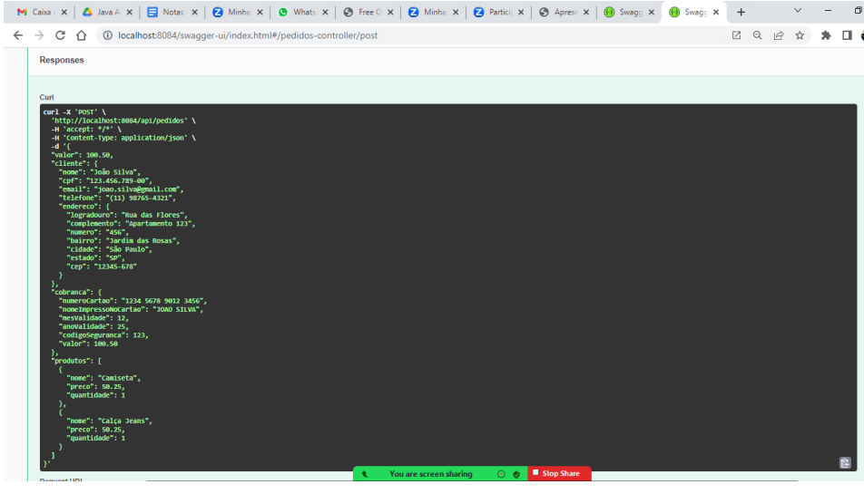 
 
 ## Teste de Integração
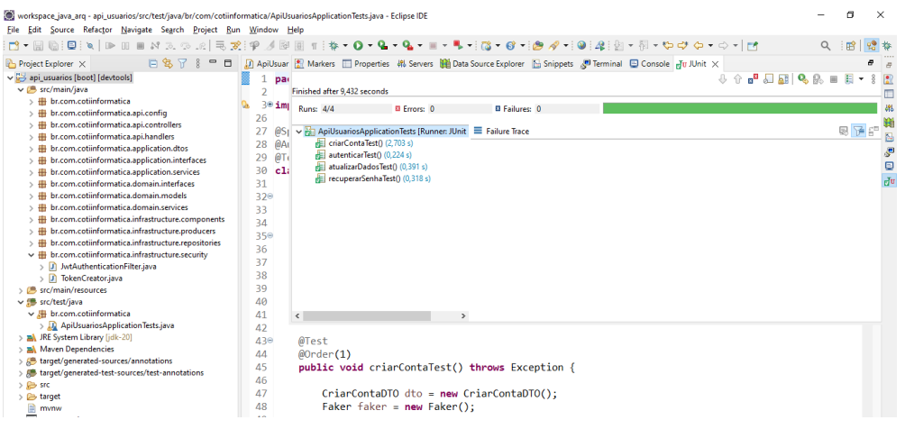 
